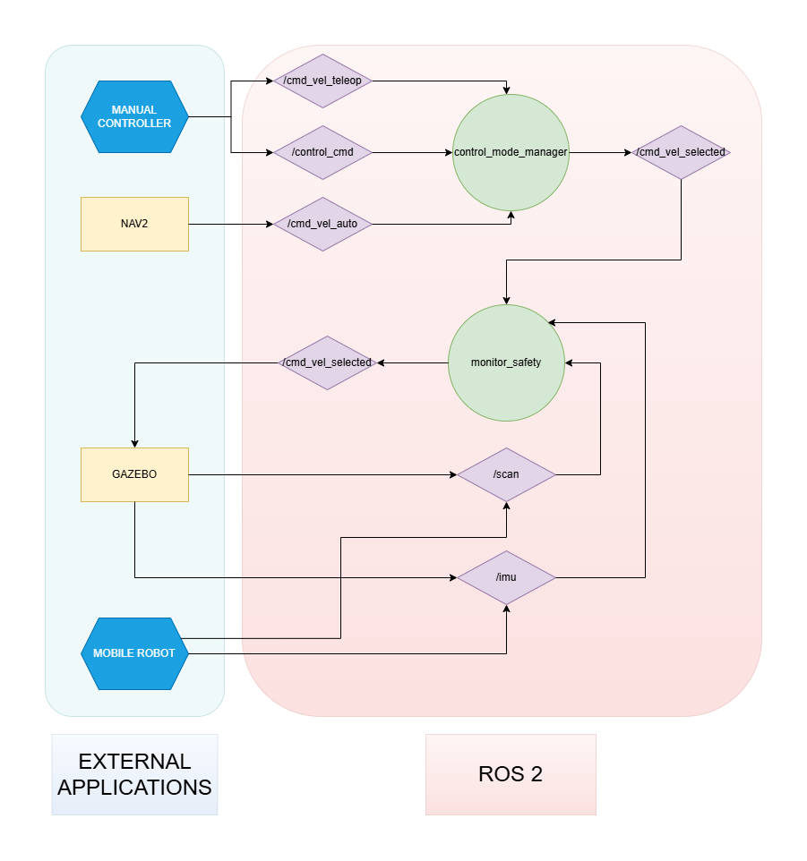

# SYSTEM ARCHITECTURE

## ROS2 Architecture

## General aspects

### Mobile Robot Architecture

#### Architecture diagram

    

#### Nodes
#### Topics

- /cmd_vel_teleop: speed from teleoperation commands. Message type: geometry_msgs::msg::Twist.
- /cmd_vel_auto: speed from automatic commands
- /cmd_control_mode: 
